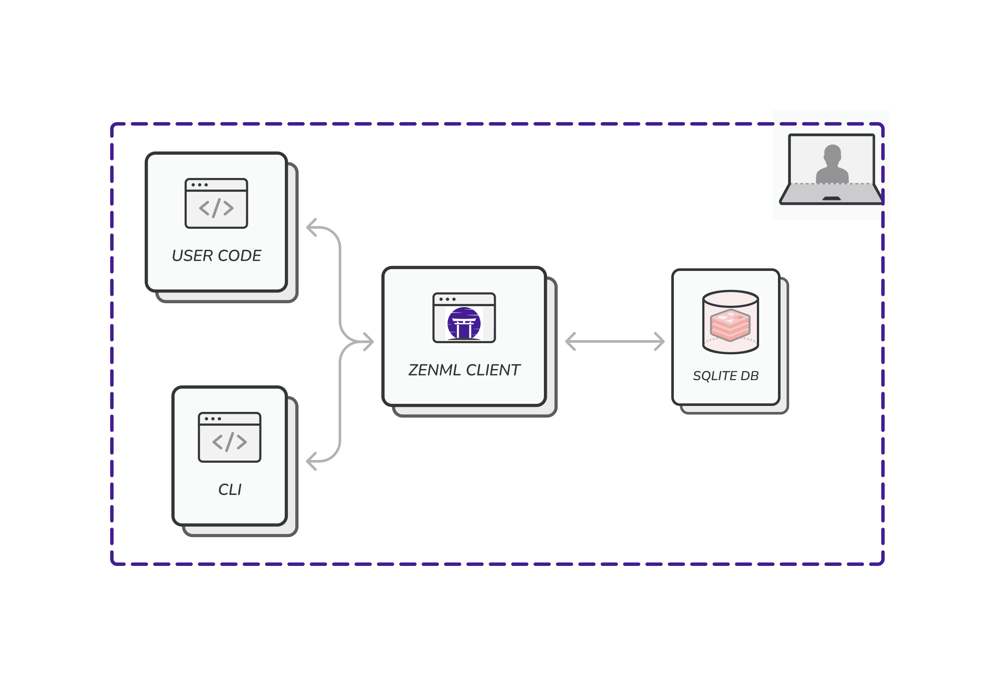
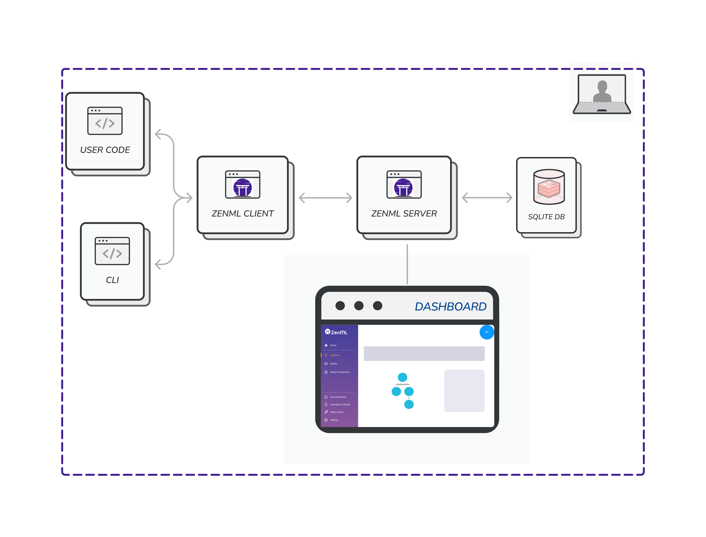

ZenML is designed to live at the interface between all the ingredients to your machine learning development environment. As such there is a lot of configuration and metadata to keep track of. This means that ZenML does not only give users an easy-to-use abstraction layer on top of their infrastructure and environments, but also needs to act as a collaborative metadata store.

## How Configurations and Pipeline Runs are tracked

A ZenML deployment consists of two components:
- A FastAPI server.
- A SQL database.

ZenML can also be deployed with an HTTP interface between the users machine 
and the database. This is also the interface used by the browser dashboard.
Especially in multi-user settings this is the recommended configuration
scenario.

ZenML relies on a SQLAlchemy compatible database to store all its data. The 
location and type of this database can be freely chosen by the user. By default,
a SQLite database is used (see [Scenario 1](#running-zenml-locally))

## Running ZenML Locally

Running ZenML locally is an easy way to experiment with your pipelines and design proof-of-concepts. Scenarios 1 and 2 below, deal with the local deployment of ZenML.

### Scenario 1: Direct interaction with Local SQLite

This is likely the first experience that users will run into. Simply pip install 
zenml and dive right in without having to worry about a thing. Your stacks,
stack components and pipeline runs all are stored on a sqlite database at
`(~/.config/zenml/local_stores/default_zen_store/zenml.db)`. The ZenML client 
creates and directly connects to this db. You don't need to worry about a thing.



* If the user wants to be fancy, find out how to configure a different location,
or different db altogether [here]().

### Scenario 2: Local Deployment of the HTTP server

* All calls go through HTTP endpoints
* Allows running the Dashboard
* Data still stored in the same location as Scenario 1
* ZenML natively supports running either in a Daemon Thread or Docker Image. Find out more [here](./docker.md)

You can setup ZenML with scenario 2 through the use of the `up` command.

```
zenml up
```

This sets up a local daemon (with options to run it as a Docker container) that is backed by a SQLite store on your machine. You also get an URL to access the ZenML Dashboard which shows your available stacks, pipeline runs and team settings among other things.




## Deploying ZenML on the Cloud: Remote Deployment of the HTTP server and Database

For a lot of use cases like sharing stacks and pipeline information with your team and for using cloud services to run your pipelines, you have to deploy ZenML on the cloud. 

// TODO 
* Explain who or what will access this deployment (user machine, dashboard,
orchestrator, step operator, ..., this is relevant as these advanced users need 
to make decisions early on) 
### Scenario 3: Server and Database hosted on cloud
* Similar to Scenario 2 but the data is now stored in an online SQL database and not locally.
* Enables collaboration between remote teams.
* Allows the use of remote stack components like the Spark step operator.

The diagram below shows the architecture: both the server and database are remote and can be provisioned and managed independently. The server takes the connection details of the database as one of its inputs and that's how they work together. You can refer to the deployment options pages, to see how it's done in each case.


Using a cloud deployment enables you to collaborate with your team members by sharing stacks and having visibility into the pipeline run by your team. Cases where only a single team with privileged access can create stacks and the other can use them are served well through this paradigm.


You can use any of the following ways to get started:
- The [`zenml deploy` CLI command](./cli.md) that provides an easy interface to deploy on Kubernetes in AWS, GCP or Azure.
- A [Docker image](./docker.md) that you can run in any environment of your choice.
- A [Helm chart](./helm.md) that can be deployed to any Kubernetes cluster (on-prem or managed).

In the following pages, we take a look at each of those options.
