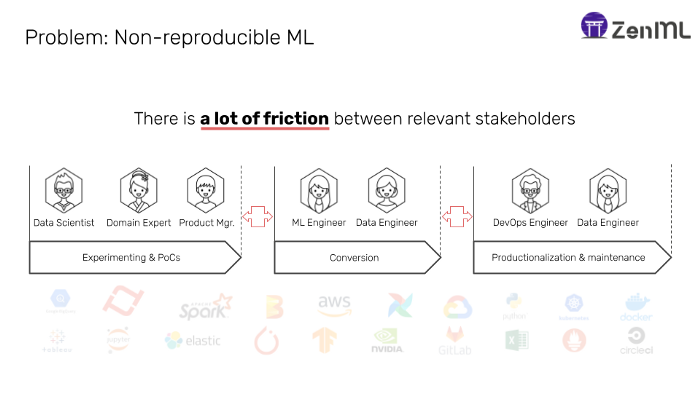

# Things to change

- [ ]  Perhaps, we can tease the ZenServer here somewhere, perhaps down below with a sub-section like: Scaling - deploy ZenML to the Cloud
- [ ]  The What section needs to talk more about integrations into the MLOps landscape and the exploding ML tooling landscape
- [ ]  Add a question mark to `Why ZenML` and get rid of the Gartner survey and motivate more in the sense of exploding MLOps tooling
- [ ]  Change Pipelining Stacking etc to directions

# ZenML: Open-source pipeline framework that integrates all your ML tools

🤹 Are you an ML engineer or data scientist shipping models to production and juggling a plethora of tools? 

🤷‍♂️ Do you struggle with versioning data, code, and models in your projects? 

👀 Have you had trouble replicating production pipelines and monitoring models in production?

✅ If you answered yes to any of the above, ZenML is here to help with all that and more...

Everyone loves to train ML models, but few talks about shipping them into production, and even fewer can do it well.
At ZenML, we believe the journey from model development to production doesn't need to be long and painful.

With ZenML, you can concentrate on what you do best - developing ML models and not worry about infrastructure or deployment tools.

If you come from unstructured notebooks or scripts with lots of manual processes, ZenML will make the path to production easier and faster for you and your team.
Using ZenML allows you to own the entire pipeline - from experimentation to production.

This is why we built ZenML. Read more [here](https://blog.zenml.io/why-zenml/).

# 💡 What is ZenML?

**ZenML** is an extensible, open-source MLOps framework for creating portable, production-ready **MLOps pipelines**. 
It's built for data scientists, ML Engineers, and MLOps Developers to collaborate as they develop to production.
**ZenML** has simple, flexible syntax, is **cloud-** and 
**tool-agnostic**, and has interfaces/abstractions that are catered towards ML workflows. 
ZenML brings together all your favorite tools in one place so you can tailor your workflow to cater your needs.

Read more on all tools you can readily use in the [integrations](https://zenml.io/integrations) section. Can't find your tool? You can always [write your own integration](https://docs.zenml.io/developer-guide/advanced-usage/custom-flavors) to use it with ZenML.

Eager to get started? We recommend the following to start using **ZenML** right away!

## **Pipelining** - Take Your First ZenML Steps

New to ZenML? Get acquainted with the [core concepts](./core-concepts.md) first 
to understand what makes ZenML so special. 
Next, jump right into [developer guide](../developer-guide/steps-pipelines/steps-and-pipelines.md) to go from zero to hero in no time.

## **Stacking** - Connect Your Favorite Tools

Already ran your first pipeline and want to know about integrations and
production use cases? Check out ZenML [integrations](https://zenml.io/integrations). You'll find detailed descriptions of specific
use cases and features. Learn how to take your 
MLOps stack from basic to fully-fledged.

## **Extending** - Make It Your Own

ZenML doesn't support your favorite tool? Worry not! ZenML is 
built from the ground up with extensibility in mind. Find out how to integrate other tools or proprietary on-prem solutions for you and your team in [Stack Components](../developer-guide/advanced-usage/custom-flavors.md). 

## **Collaborating** - Work Together With Your Team

Share not only your code but also your ZenML stacks with your team. Find out how in [collaboration](../collaborate/collaborate-with-zenml.md). 

## **Resources** - Learn ZenML with Tutorials, Examples, and Guides

The ZenML team and community have put together resources to learn about the framework. Learn more in [resources](../guidelines/index.md).

## **Community** - Be Part of the ZenML Family

Can't really find what you want and need help? Join our [Slack group](https://zenml.io/slack-invite/). Ask questions about bugs or specific use cases and get a quick response from the ZenML core team.