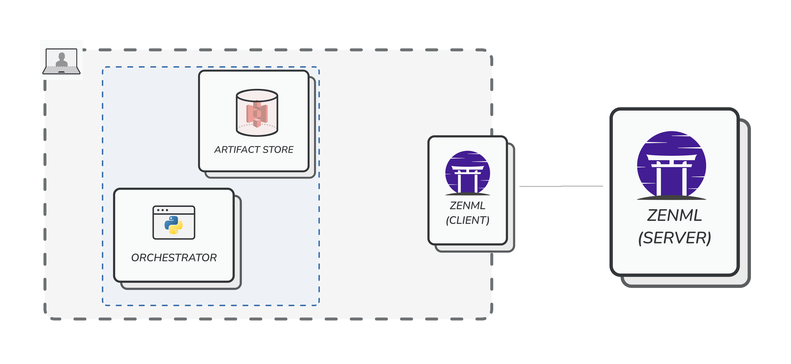
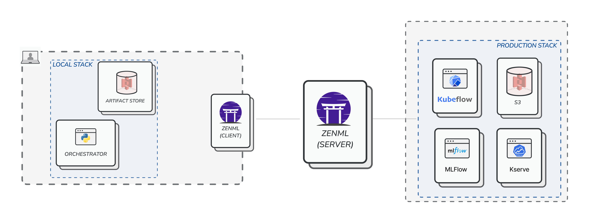
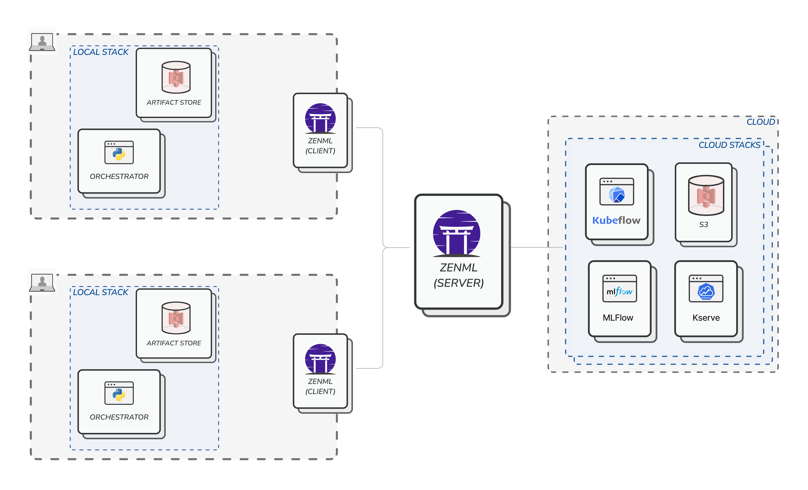

# Things to change

- We should focus here on the ZenML Server
- Perhaps mention import and export as a limited option to open this page
- Show how collaboration is thought off - maybe mention roles
- Maybe add an architecture diagram

## Step 1: Single user working with local stacks



## Step 2: Single user working with local and cloud stacks



## Step 3: Multiple users working with local and cloud stacks



## Collaboration with ZenML Overview


# Old Content (1)

# ZenML for Teams and Organizations

Using ZenML to develop and execute pipelines from the comfortable confines of
your workstation or laptop is a great way to incorporate MLOps best practices
and production grade quality into your project from day one. However, as machine
learning projects grow, managing and running ZenML in a single-user and
single-machine setting can become a strenuous task. More demanding projects
involve creating and managing an increasing number of pipelines and complex
Stacks built on a wider and continuously evolving set of technologies. This can
easily exceed the capabilities of a single machine and person or role.

The same principles observed in the ZenML single-user experience are applicable
as a framework of collaboration between the various specialized roles in the
AI/ML team. We purposefully maintain a clean separation between the core ZenML
concepts, with the intention that they may be managed as individual
responsibilities assigned to different members of a team or department without
incurring the overhead and friction usually associated with larger
organizations.

One such example is the decoupling of ZenML Stacks from pipelines and their
associated code, a principle that provides for a smooth transition from
experimenting with and running pipelines locally to deploying them to production
environments. It is this same decoupling that also allows ZenML to be used
in a setting where part of a team is iterating on writing ML code and
implementing pipelines, while the other part is defining and actively
maintaining the infrastructure and the Stacks that will be used to execute
pipelines in production. Everyone can remain focused on their responsibilities
with ZenML acting as the central piece that connects and coordinates everything
together.

The ability to configure modular Stacks in which every component has a
specialized function is another way in which ZenML maintains a clean separation
of concerns. This allows for a MLOps Stack design that is natively flexible and
extensible that can evolve organically to match the size and structure
of your AI/ML team and organization as you iterate on your project and invest
more resources into its development.

This documentation section is dedicated to describing several ways in which you
can deploy ZenML as a collaboration framework and enable your entire AI/ML team
to enjoy its advantages.

## Export and Import ZenML Stacks

If you need to quickly share your Stack configuration with someone else, there
is nothing easier than [using the ZenML CLI to export a Stack](./stack-export-import.md)
in the form of a YAML file and import it somewhere else.

## Centralized ZenML Management with ZenML Server

With the [_ZenML Server_](./zenml-server.md), you can deploy ZenML as a centralized
service and connect entire teams and organizations to an easy to manage
collaboration platform that provides a unified view on the MLOps processes,
tools and technologies that support your entire AI/ML project lifecycle.

---
description: How to export and import stacks to YAML files
---

# Old Content (2)

# Export and Import ZenML Stacks

If you wish to transfer one of your stacks to another user or even another
machine, you can do so by exporting the stack configuration and then importing
it again.

To export a stack to YAML, run the following command:

```bash
zenml stack export STACK_NAME FILENAME.yaml
```

This will create a FILENAME.yaml containing the config of your stack and all
of its components, which you can then import again like this:

```bash
zenml stack import STACK_NAME -f FILENAME.yaml
```

## Known Limitations

The exported Stack is only a configuration. It may have local dependencies
that are not exported and thus will not be available when importing the Stack
on another machine:

* the secrets stored in the local Secrets Managers
* any references to local files and local services not accessible from outside
the machine where the Stack is exported, such as the local Artifact Store and
Metadata Store