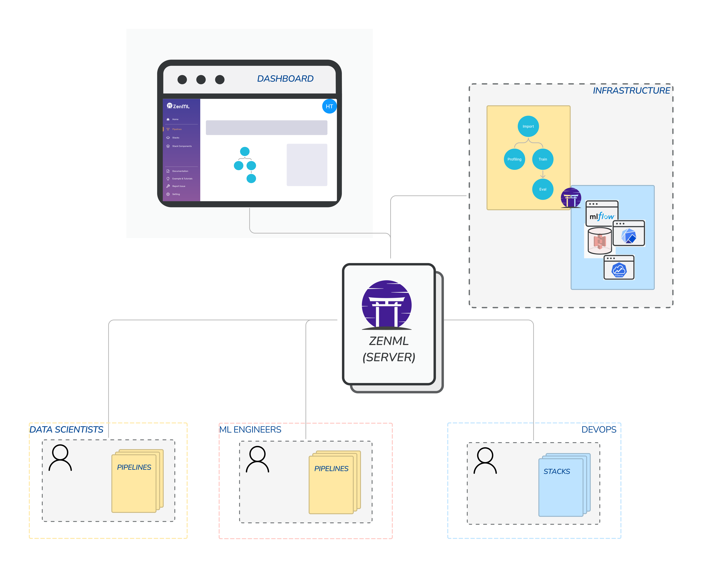
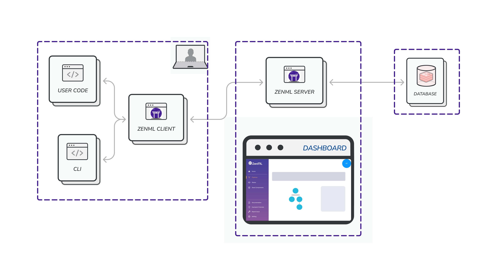

## Collaboration with ZenML Overview

The ZenML Server is a distributed client-server ZenML deployment scenario in which multiple ZenML clients can connect to a remote service that provides persistent storage and acts as a central management hub for all ZenML operations involving Stack configurations, Stack Components and other ZenML objects.

A typical organization scenario with ZenML is to have Data Scientists or ML Engineers write pipelines, while the DevOps Engineers help them provision and
register stacks. Typically, one can go through a CI/CD workflow to run pipelines on various different stacks.

Working with a ZenML Server involves two main aspects: deploying the ZenServer somewhere and connecting to it from your ZenML client. In this section, we will learn about the simplest way to deploy ZenML with the CLI, but [there are other similarly easy options available](../../getting-started/deploying-zenml/deploying-zenml.md).

### Deploying with the CLI

The easiest and fastest way to get running on the cloud is by using the `deploy` CLI command. It currently only supports deploying to Kubernetes on managed cloud services. 

Before we begin, it will help to understand the [architecture](../../getting-started/deploying-zenml/deploying-zenml.md#scenario-3-server-and-database-hosted-in-the-cloud) around the ZenML server and the database that it uses. Here is an illustration:

